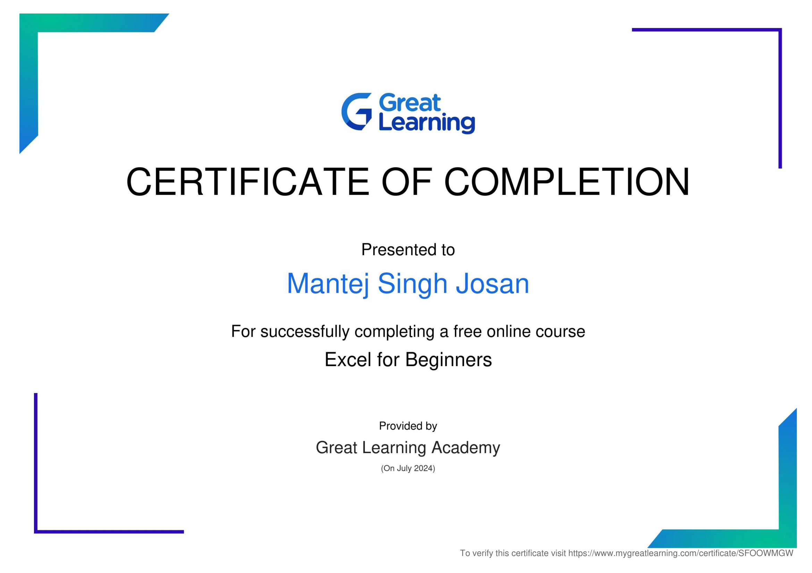

# Portfolio : [Mantej Singh Josan](https://github.com/mantejjosan)


# Tech Stack

- HTML5
- CSS
- Javascript
- python
- C 
- Java

# Projects
- [Snake Game Using Javascript](https://mantejjosan.github.io/snake-game/game-intro)
- *Further projects coming Soon...*

# Blogs
GNDEC blog: [my experience at gndec](https://mantejjosan.github.io/my-gndec-experience/)


# Certifications
- Excel for Beginners by Great Learning
- 



# Formal Education

| Institution | Course | Year |
|-------------|--------|------|
| [GNDEC](http://www.gndec.ac.in) | B.Tech CSE | 2024 |
| [Sacred Heart School, Moga](http://www.shsmoga.com) | 12th | 2023 |
| [Sacred Heart School, Moga](http://www.shsmoga.com) | 10th | 2021 |


## Subjects and Score Card

 **10th**

| Subject   | Total Marks | Marks Obtained |
|-----------|-------------|----------------|
| English   | 100         | 90             |
| CS        | 100         | 90             |
| Physics   | 100         | 90             |
| Chemistry | 100         | 90             |
| Math      | 100         | 90             |
| Punjabi   | 100         | 90             |

*```POV: I don't have access to my marksheet now```*

**12th**

| Subject   | Total Marks | Marks Obtained |
|-----------|-------------|----------------|
| English   | 100         | 95             |
| CS        | 100         | 98             |
| Physics   | 100         | 92             |
| Chemistry | 100         | 89             |
| Math      | 100         | 83             |
| SUPW      | Grade       | A              |


# Contact Details

- Email: [mantejjosan@gmail.com](mailto:mantej416@gmail.com)
- Github: [mantejjosan](https://github.com/mantejjosan)
- LinkedIn: [mantejjosan](https://www.linkedin.com/in/mantej-singh-josan-048661275?utm_source=share&utm_campaign=share_via&utm_content=profile&utm_medium=android_app)
